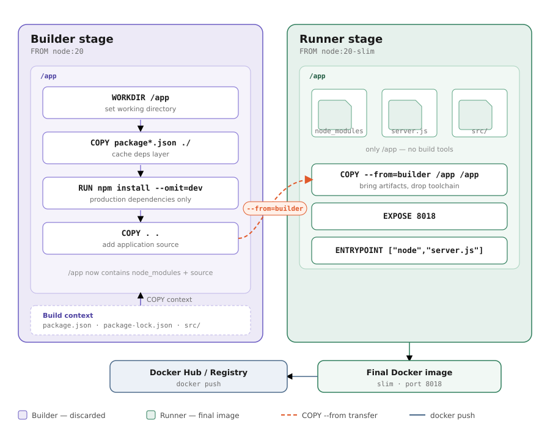

# Polyglot Microservices

Nine independent HTTP servers, each implementing the same `GET /` endpoint in a different language. Every service returns the same structured JSON response and logs to stdout.

## Services

| Service    | Language   | Native port | Docker host port |
|------------|------------|-------------|-----------------|
| rust       | Rust       | 8011        | 8011             |
| php        | PHP        | 8013        | 8013             |
| dart       | Dart       | 8014        | 8014             |
| java       | Java 17    | 8015        | 8015             |
| go         | Go         | 8016        | 8016             |
| python     | Python 3   | 8017        | 8017             |
| javascript | Node.js    | 8018        | 8018             |
| bash       | Bash + nc  | 8019        | 8019             |
| csharp     | C# .NET    | 8020        | 8020             |

## Quick Start

**Run a single service:**
```bash
./run.sh rust
./run.sh rust 9000    # custom port
```

**Run all services in the background:**
```bash
./run.sh all
kill 0               # stop all
```

**Run via Docker Compose:**
```bash
docker compose up              # all services
docker compose up rust go      # specific services
```

## API Contract

Every service implements the same contract:

- `GET /` → HTTP 200 with JSON body
- Any other path/method → HTTP 404
- Reads `X-Trace-Id` request header; generates a UUID if absent

**Response shape:**
```json
{
  "timestamp": "2024-01-01T00:00:00Z",
  "level": "info",
  "service": "<lang>-api",
  "message": "GET / success",
  "request": {
    "method": "GET",
    "url": "/",
    "headers": { "user-agent": "..." },
    "ip": "127.0.0.1"
  },
  "response": {
    "status_code": 200,
    "response_time_ms": 12
  },
  "meta": {
    "request_id": "<trace_id>",
    "user_id": 42
  }
}
```

**Stdout access log per request:**
```json
{ "code": 200, "message": "OK", "method": "GET", "path": "/", "trace_id": "...", "timestamp": "..." }
```

## Per-Language Notes

**Rust** (`rust-project/`) — actix-web, set `RUST_LOG=info` for log output
```bash
cargo check && cargo test && cargo run
```

**Go** (`go/`)
```bash
go run .
```

**Python** (`python/`)
```bash
python3 server.py
```

**JavaScript** (`javascript/`) — no dependencies
```bash
node server.js
```

**Java** (`java/`) — Spring Boot 3.3.0, uses `SERVER_PORT` instead of `PORT`
```bash
mvn spring-boot:run
```

**Dart** (`dart/`)
```bash
dart pub get && dart run bin/server.dart
```

**C#** (`csharp/`)
```bash
dotnet run
```

**PHP** (`php/`)
```bash
php -S 127.0.0.1:8013 index.php
```

**Bash** (`bash/`) — handles one request per loop iteration via `nc`
```bash
./server.sh
```

## Diagrams


